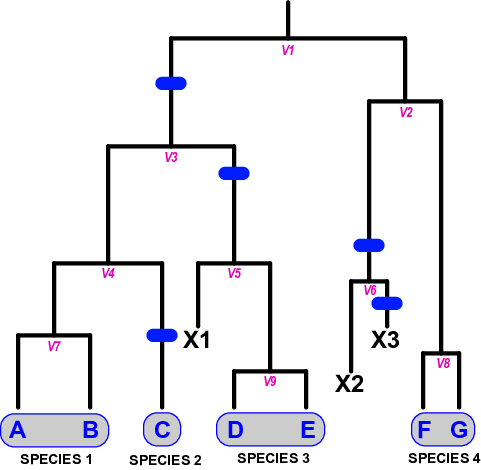

##############
Basic Concepts
##############

"Partitions"
============

The primary output of |delineate| is essentially calculation of the probabilities of different *partitions* of the population lineages in the study into distinct species.
Each partition represents a different collection of assignments of species identities to each of the population lineages.
The term "partition" here comes from basic set theory: it is a division of a set of elements into a set of *mutually exclusive* and *jointly comprehensive* subsets.
In this application, we are considering the population lineages (i.e., the tips of the population tree we give as input to |delineate|) as the elements of the initial set.
We want to organize this set of populations into distinct subsets, where each subset corresponds to a distinct species.

For example, imagine that that we have a system consisting of three populations, A, B, and C, which can be represented by the following set of three elements:

.. role:: raw-html(raw)
   :format: html

:raw-html:`
{A, B, C}
`

What are the different "species delimitations" are possible with this system?
That is, what are the different ways we can we organize this set of populations in to species?

    1.  One way might be to split off each population to its own distinct species, i.e.:

.. role:: raw-html(raw)
   :format: html

:raw-html:`
{ {A}, {B}, {C} }
`

    2.  Another way would be to lump all the populations to the same species, i.e.:

.. role:: raw-html(raw)
   :format: html

:raw-html:`
{ {A,B,C} }
`

    3.  Another way might be to have A and B assigned to the same species, but C to a different one:

.. role:: raw-html(raw)
   :format: html

:raw-html:`
{ {A,B}, {C} }
`

    4.  Or, alternatively, A and C to the same species, but B to a different one:

.. role:: raw-html(raw)
   :format: html

:raw-html:`
{ {A,C}, {B} }
`

    5.  Or, finally, B and C to the same species, but A to a different one:

.. role:: raw-html(raw)
   :format: html

:raw-html:`
{ {A}, {B,C} }
`

Each of these five arrangements is a distinct partition of the original set of three elements.
Thus, each possible partition of set of population lineages represents a different way of organizing that set of population lineages into species.
|delineate| will report the probabilities of each of these partitions for your data.
The partition with the highest probability represents the maximum likelihood estimate (MLE) of the species identities of the populations in your system.

For a given set of lineages, there are as many possible partitions as there are distinct groupings of lineages into subsets.
Each subset of lineages in a particular partition represents a distinct species, and, conversely, the membership of a particular lineage in a particular subset of a given partition is an assignment of that lineage to the species identity represented by that subset.
Thus, each partition represents a particular delimitation of lineages into species.
The boundaries between species then simply correspond to the boundaries between the subsets of the preferred partition.
The goal of our analysis is to identify the partition that best fits our data.

..
    The number of partitions possible for a set increases with the number of elements in the set.
    In fact, it increases very, very, very, very, very, very, `*very* rapidly <https://mathworld.wolfram.com/BellNumber.html>`_.

The Diversification Process
===========================

How are the probabilities of these different partitions of population lineages calculated?
To understand that we have to understand how |delineate| models the diversification process.
|delineate| models diversification with the following events:

-   *population splitting*
-   *population extinction*
-   *evolution of reproductive isolation of an independent population lineage*

Population splitting, i.e. the fragmentation of an ancestral population lineage into two independent daughter lineages, corresponds to a birth event on a tree of populations (from one or more species) .
Each of the two daughter lineages proceeds on its own independent trajectory, still part of the same species as the parent population lineages, until they either themselves split into further daughter lineages, go extinct (corresponding to death events on a tree of populations), or develop into a distinct species (from either parent or sister population).
As modeled by |delineate| the formation of new independent population lineages (birth events on a tree), the loss of these lineages due to extinction (death events on a tree), and the development of a lineage into a full independent species, are modeled as three independent processes, each with their own distinct rate.
Birth events on a tree can be considered the (potential) origin of a new species, and the the development of full independent species status as the completion of this phenomenon.
As such, with |delineate| speciation is not an instantaneous event (such as that modeled by a simple birth-death branching model underlying a species tree), but an extended process, starting with the lineeage splitting and ending with the speciation completion event.

Formation of New Species
========================

We can consider the speciation completion process to "play out" over a birth-death tree, much in the same way as character evolution might occur on a phylogeny.
Seen in this way, the tree of population lineages grows through a standard birth-death process, with a fixed birth rate and death rate representing the rate of population lineage splitting and extinction  respectively.
As noted above, a splitting event on this phylogeny does *not* represent a speciation event --- it just represents an ancestral population fragmenting into two isolated daughter populations.
Both daughter populations (as well as the nominally extinct ancestor population) belong to the same species.
The splitting event can be considered the initiation of potential speciation, however, as the isolation of the two daughter lineages essentially provides an opportunity for one or both of them to develop full reproductive isolation and thus achieve full independent species status.

Development of full independent species status is when a *speciation completion event* occurs on one of the daughter lineages before it goes extinct or itself split.
Seen in this way, a "species" in |delineate| is a set of population lineages on the population tree in which there is *no* speciation completion event on the edges connecting them on the tree.
If there is at least one speciation completion event on the edge path between two lineages, then the two lineage are in different species.

    Lineage splitting events correspond to the formation of new population lineages, not species, through restrictions in gene flow in an ancestral population (V1).
    These lineages may themselves give rise to other population lineages (V2 through V9), or go extinct (X1 through X3).
    Population lineages develop into an independent species at a fixed background rate, providing they are not otherwise lost  (i.e., there is duration between the initiation and completion of speciation).
    Changes in status from incipient to full or good species are marked by speciation completion events, shown by the blue bars.
    A "species" is thus made up of one or more population lineages not separated from one another by a speciation event.
    In this example, five speciation completion events divide the seven extant populations into four species: {A,B}, {C}, {D,E}, and {F,G}.

The Speciation Completion Rate
==============================

Speciation completion, i.e. the transition of an incipient species to full species status, completing a trajectory that started with its original splitting from a parent or sister population, proceeds at a rate given by the *speciation completion rate*.
This rate is one of the critical parameters that inform the probability of different species partitions, i.e. the different possible combinations of assignments of species identities to the various population lineages in the system.
For example, with a high species completion rate, partitions with more species would be more probable than partitions with fewer species as we would expect there to be more speciation completion events to have occured on the tree.
Conversely, with a low species completion rate, partitions with fewer species would be more probable than partitions with more species.

Of course, other things, such as tree structure and branch lengths, in addition to the speciation completion rate, determine the exact probability of particular partition.
As membership in one species or another (i.e., the species identity of population lineages) is determined by species boundaries between lineages, and as species boundaries are effectively established by speciation completion events on branches on paths between lineages (see above), we can see how tree structure, branch lengths, *and* the speciation completion interact to determine the probability of different partitions.
For example, a higher speciation completion rate will mean that it is more probably that a speciation completion event occurs on a particular branch.
Similarly, the longer a particular branch, the more probable a speciation completion event will occur on it for a particular speciation completion rate.

Estimating the Speciation Completion Rate
=========================================

So, we have seen how critical the speciation completion rate is in determining the probability of different partitions, and, consequently, the species identities of our populations.

Where do we get the speciation completion rate from?

We get it from our data.

Now, at this point, you may be wondering, if we do not know *any* of the species identities of the populations in our system, how are we going to estimate the speciation completion rate?

The answer is that, under these circumstances, we *cannot*.

We *might* be able to estimate this rate under the same model on a different but related system and then use the rate over here, analogous to estimating the time-calibrated mutation rate on, say, warblers and using it on finches.
But a better approach is available, and is the way that we recommend that |delineate| be used.

A Different Way of Doing Business
=================================

|delineate| requires a fundamentally different way to thinking how we sample data for species delimitation studies.
When designing a study to use |delineate|, you should include a broad sampling of populations, including many populations whose species identities that you *do* know or are reasonably certain of in addition to the population lineages whose species identities you wish to estimate.
You them communicate to |delineate| the species identities of the population lineages you are fixing to known values as "constraints".
When running the analysis, |delineate| will use these constrainted species identities to estimate the speciation completion rate, and then use this value to calculate the probabilities of all possible *remaining* partitions.
These "possible partitions" are the partitions that remain valid while meeting the provided constraints.

For example, consider a system of six populations: "A", "B", "C", "D", and "E".
We actually do know the species identities of three of these populations ("A" through "C"), and are only uncertain about "D" and "E".
So, current taxonomy that we agree with places "A" and "B" into one species (say, "S1") and "C" in another (say, "S2").
Our collection efforts have picked up two new population lineages "D" and "E", and it is the species identities of *these* that we are interested in determining through a |delineate| analysis.
They could be (new) independent species, or they could belong to one of the two species that we already know about ("S1" or "S2").
When running the |delineate| analysis, we provide the following constraints:

+---------+---------+--------+
| lineage | species | status |
+=========+=========+========+
| A       | S1      | 1      |
+---------+---------+--------+
| B       | S1      | 1      |
+---------+---------+--------+
| C       | S2      | 1      |
+---------+---------+--------+
| D       | ?       | 0      |
+---------+---------+--------+
| E       | ?       | 0      |
+---------+---------+--------+

As can be seen, with the "1" value in the "status" column for population lineages "A", "B", and "C", we constrain their species identities to the species with the label given in the "species" field.
At the same time, with the "0" value in the "status" column for population lineages "D" and "E", we tell |delineate| that the species identities of the these population lineages are unconstrained, and |delineate| should calculate the probabilities of all possible species identities for these species.
In the subsequent analysis, then any partition that does NOT have a subset ("species") that includes "A" and "B" will be excluded, as will any partition that places "C" in the same subset ("species") as "A" and "B".
However, the probabilities of all other possible partitions, with all other combinations of placements of "D" and "E" will be calculated:

    +----+------------------------------+
    | 1. | { {A,B},     {C},    {D,E} } |
    +----+------------------------------+
    | 2. | { {A,B,D},   {C},    {E}   } |
    +----+------------------------------+
    | 3. | { {A,B}      {C,D}   {E}   } |
    +----+------------------------------+
    | 4. | { {A,B,E},   {C},    {D}   } |
    +----+------------------------------+
    | 5. | { {A,B}      {C,E}   {D}   } |
    +----+------------------------------+
    | 6. | { {A,B,D,E}  {C} }           |
    +----+------------------------------+
    | 7. | { {A,B}      {C,D,E} }       |
    +----+------------------------------+

Sampling Design
===============

|delineate| ideally should be provided with data that *includes samples from as many populations as possible across the system* being studied. This is in contrast from standard practice from other approaches, in which typically one or two examplar population sample per putative species are included. The theoretical ideal would be to include *every* population of all species in the system, known or unknown, i.e., to capture all population isolation or splitting events. Of course, we do not expect to achieve this theoretical ideal in practice, but it is certainly something to aspire to. The key point is restricting our population/species sampling to a few examplar populations per species is something we want to move away from.

|delineate| also requires that we have know the species identities of at least *some* of our population lineages. This is, again, in contrast to other approaches to species delimitation, which might be quite happy analyzing an entire data set with no known fixed species identities. With |delineate| we should design our sampling scheme to including a much broader range of species than just the ones we are interested in delimiting, and should include populations belong to species in which we are quite confident regarding their species identities. These other species --- or, to be more precise, population lineages for which the species identities are known --- are critical to allowing |delineate| to "learn" about the speciation process.

Workflow: From Individuals to Populations to Species
====================================================

The |delineate| package itself represents the final step in an analytical pipeline.
Starting with a collection of genetic alignments representing multiple genes sampled from multiple individuals from multiple populations, each step of the pipeline groups the data into successively higher levels of organization, from populations to species.

A typical species delimitation analysis would consist of the following three steps:

    1.  **Identification (Delimitation) of *Population* Units:** First, we would carry out a |BPP|_ analysis to identify population units by aggregating individuals into populations under the multipopulation coalescent model. We would typically hope to sample at least a few genes from two to ten individuals per population, with multiple populations per putative species.
        We would then use |BPP|_ to organize these individuals into populations.
        Note that |BPP|_ terminology uses the term "species" and "populations" interchangeably. This can be confusing, but it is important to keep this in mind.

    2.  **Organization of the Population Units into a Population Phylogeny:** Then, we would carry out a |StarBeast2|_ analysis using the groupings identified by |BPP| as "species", to estimate an ultrametric phylogeny with those groupings as tips (i.e, a population phylogeny).
        Once we have decided what our population units are, we will use |StarBeast2|_ to infer an ultrametric population tree to use as input. Here, again, while |StarBeast2| uses the terminology "species" to reference to groupings of individuals, we should bear in mind that we are still dealing with population. We will use the units identified as populations by BPP as the "species" grouping in |StarBeast2|.

    3.  **Calculating the Probability of Species Assignments:** Finally, the actual species delimitation analysis itself: a |delineate| analysis to calculate the probabilities of different groupings of population tips of the population tree into species.
        The population tree resulting from |StarBeast2|_ forms the one of the mandatory inputs for |delineate|. The species identities for the subset of population lineages for which these are known forms the other. Running |delineate| will then report on the probabilities of different species assignments for the remaining lineages, i.e. for the ones for which we do not know or specifies the species identities.

